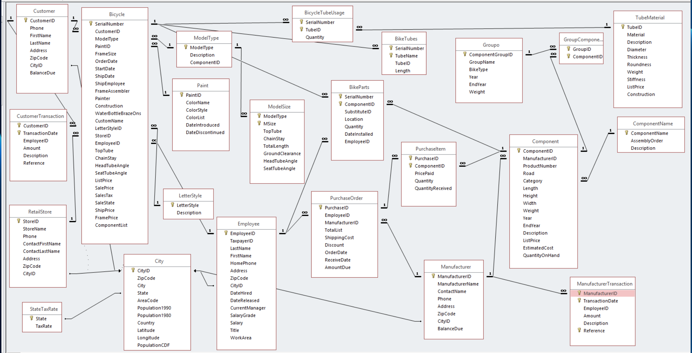

## 🛠️ Bike Shop Relational Database (Microsoft Access & SQL)

This SQL project demonstrates the ability to build and query a normalized relational database for a fictional bike shop. It includes practical business scenarios and showcases advanced querying techniques.

### 🗃️ Features

- Normalized table design for core business entities: Customers, Bicycles, Paint, Models, Manufacturers, Orders, and Employees.
- Advanced SQL queries featuring:
  - Multi-table joins
  - Date and string filtering
  - Aggregation and ordering
  - Subqueries and distinct filtering

### 🧠 Example Use Cases

1. **Customer Reports**: List customers from California who bought red mountain bikes in Sept 2003.
2. **Sales Tracking**: Find employees who sold race bikes directly in Wisconsin in 2001.
3. **Component Inventory**: Display unique rear derailleurs used in Florida road bikes sold in 2002.
4. **Largest Frame Sold**: Determine the buyer of the largest full suspension mountain bike in Georgia (2004).
5. **Discount Analysis**: Identify the manufacturer that gave the highest order discount in 2003.

### 📄 Technologies

- Microsoft Access
- SQL Server
- Relational Schema Design
- ERD principles

### Relational Database
This ERD visualizes the relational schema of the Bike Shop database.
- Key relationships demonstrate:
  - **Customer orders and transactions** tied to employees and bicycles
  - **Bicycles** composed of various parts, sizes, and paint options
  - **Component tracking** through purchase orders, inventory, and usage
  - **Manufactuer** and **Store Locations** mapped by city and state
  - Full normalization to reduce redundancy and enforce data integrity

